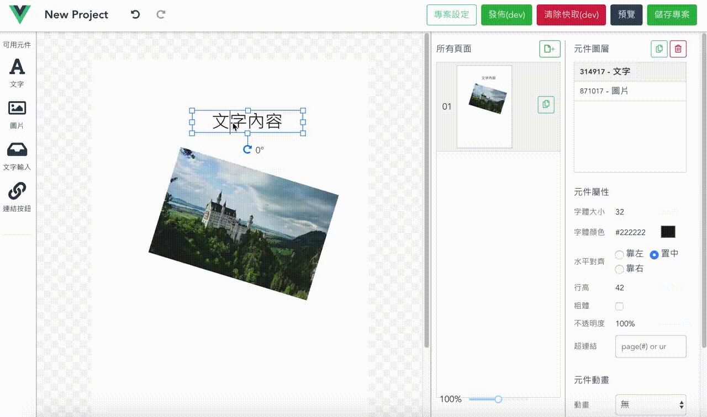
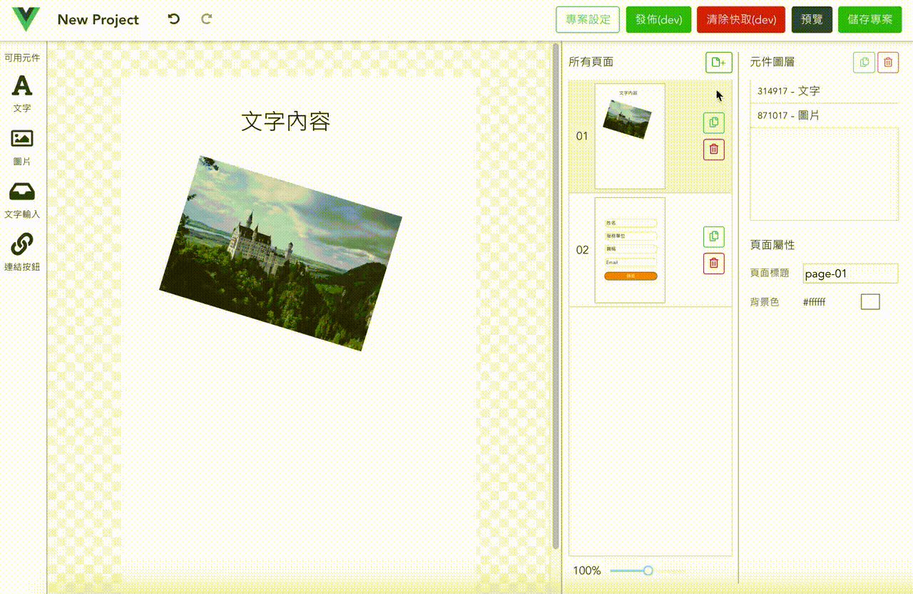

> 視覺化拖曳式的手機頁面編輯器

這個專案使用Vue進行開發，專案目的是製作一個元備的手機頁面編輯器，具有拖曳式的操作界面，大部分操作可使用滑鼠完成。

頁面元件使用Vue component方式進行設計開發，具有良好的擴充性。元件包含共有與獨立的屬性，可對元件進行移動、旋轉、縮放的操作，而選擇複數元件後可進行群組管理。

專案使用Vuex進行資料流和狀態管理，並且配合localStorage實現暫存。

## 作品截圖

### 平移、拖曳、縮放功能

### 群組功能

### 預覽功能
